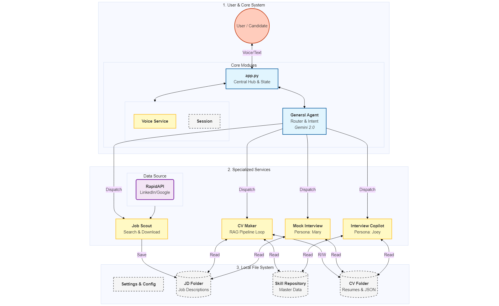

# Joey - The Voice-Enabled End-to-End Career Copilot

> **Powered by Google Gemini & Google Agents Development Kit (ADK)**

## 📖 Project Overview

**Joey** is an intelligent, voice-enabled AI career assistant designed to guide job seekers through every stage of the employment journey. Unlike generic chatbots, Joey acts as a proactive partner, seamlessly integrating **Job Search**, **CV/Resume Tailoring**, **Mock Interview Practice**, and **Real-time Interview Assistance** into a single, cohesive workflow.

At its core, Joey leverages the power of **Google's Gemini Pro model** and the **Agentic workflow** patterns (Sequential & Loop) provided by the **Google ADK**, creating a system that not only understands user intent but also executes complex, multi-step tasks autonomously.

## ✨ Key Features

### 1. 🕵️‍♂️ Smart Job Scouting (The "Eyes")
* **Dual-Engine Search:** Integrated with both **LinkedIn** and **Google Jobs** APIs for comprehensive market coverage.
* **Automated Fetching:** Proactively scouts for relevant job openings based on user preferences and keywords.
* **Data Normalization:** Standardizes diverse job description schemas into a unified format for downstream processing.

### 2. 📄 Agentic CV & Cover Letter Tailoring (The "Hands")
* **Multi-Agent Pipeline:** A sophisticated **Sequential & Loop** agent architecture that mimics a human professional's workflow:
    1.  **Analyst Agent:** Extracts key requirements and hard/soft skills from the Job Description (JD).
    2.  **Researcher Agent (RAG):** Searches the user's personal Skill Repository to find the best-matching evidence for each requirement.
    3.  **Writer Agent:** Synthesizes the findings into a tailored, impactful CV summary and cover letter draft.
    4.  **Quality Control Loop (Critic & Editor Agents):** Iteratively reviews and refines the draft against the JD until it meets high-quality standards.

### 3. 🎤 Immersive Mock Interview (The "Mouth" & "Ears")
* **Persona Switching:** The AI dynamically switches personas between a professional **Hiring Manager** (for the interview) and a supportive **Career Coach** (for feedback).
* **Contextual Awareness:** The interviewer persona is strictly bounded by the provided resume and JD, ensuring a realistic simulation.
* **Voice-First Interaction:** Features a low-latency local voice stack (Faster-Whisper STT + Edge-TTS) for a natural, hands-free conversational experience.

### 4. 🧠 Real-time Interview Copilot (The "Brain")
* **Live Assistance:** Acts as a "whisperer" during an actual or mock interview.
* **Instant Recall:** When the user is stuck, the Copilot instantly retrieves the best "STAR" story from their Skill Repo relevant to the current question.
* **Strategic Advice:** Provides concise, actionable talking points in real-time.

## 🏗️ System Architecture

Joey is built on a **Hub-and-Spoke** architecture, with a central **General Advisor Agent (Router)** orchestrating four specialized services.



1.  **General Advisor Agent (Hub):** The main interface that understands user intent and routes tasks.
2.  **Job Scout Service:** Handles external API interactions for job searching.
3.  **CV Maker Service:** Manages the complex multi-agent pipeline for document generation.
4.  **Mock Interview Service:** Handles context engineering and persona management for practice sessions.
5.  **Interview Copilot Service:** Provides real-time, RAG-based assistance.

## 🚀 Getting Started

### Prerequisites

* Python 3.9+
* A Google Cloud Project with the **Gemini API** enabled.
* A **RapidAPI** account with subscriptions to LinkedIn and Google Jobs APIs.

### Installation

1.  **Clone the repository:**
    ```bash
    git clone [https://github.com/your-username/joey-career-copilot.git](https://github.com/your-username/joey-career-copilot.git)
    cd joey-career-copilot
    ```

2.  **Install dependencies:**
    ```bash
    pip install -r requirements.txt
    ```
    *(Note: For local voice support, you may need to install FFmpeg on your system.)*

3.  **Configuration:**
    * Create a `.env` file in the root directory and add your API keys:
        ```env
        GOOGLE_API_KEY=your_google_api_key
        RAPIDAPI_KEY=your_rapidapi_key
        ```
    * Review `settings.ini` to customize paths, model selection, and default search settings.
    * Update your user profile in `user_profile.json` and populate your `Skill_Repository/Master_Resume.docx`.

### Usage

1.  **Start the application:**
    ```bash
    python app.py
    ```

2.  **Interact with Joey:**
    * **Voice Mode:** If enabled, just start speaking after the prompt.
    * **Text Mode:** Type your commands into the console.

**Example Commands:**
* "Find TM1 Developer jobs in Sydney."
* "Generate a CV for the KPMG role I just found."
* "Start a mock interview for that KPMG job."
* (During interview) "Joey, help me answer this question."

## 📂 Project Structure